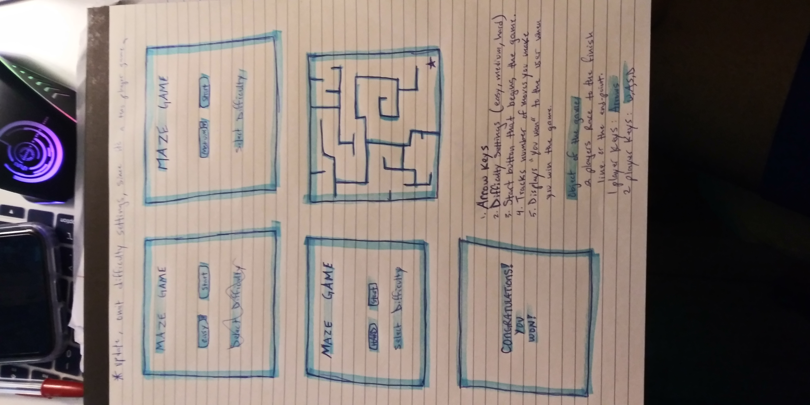

# MazeRace
game

#Wireframe

#Game Intructions
1. Program begins with a start button

2. Random maze generates right before the users eyes

3. click start button

3. Match begins. Objective of game, both users compete to reach end point. First user to reach the end point.

4. The winner's user name gets displayed with the number of moves and a time stamp.

# Schedule (Objective/Goals)
### Wednesday
1. wireframes
2. Pseudo code

### Thursday
1. JS
2. boardGame function

### Saturday
1. HTML/CSS